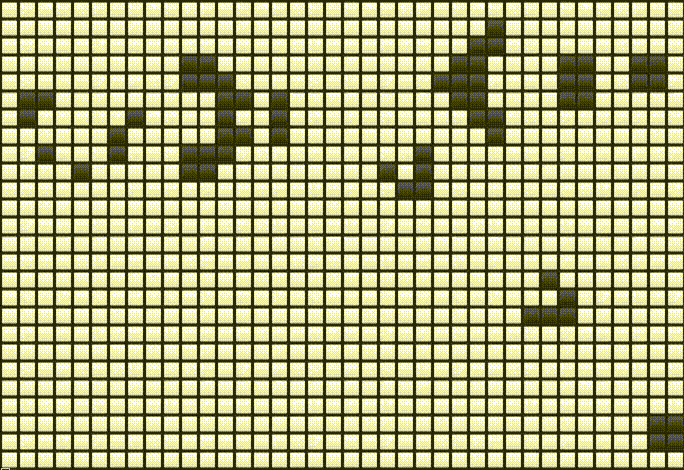

# John Conway's Game of Life

John Conway's Game of Life cellular automaton simulation implemented in C++, with CMake as buildsystem.



This code simply prints/draws the current grid state into your terminal as unicode characters.
It's only been tested on linux (kitty, gnome-terminal, guake) it may work on windows as long as your terminal supports the display of unicode characters (such as \u2B1B ⬛ & \u2B1C ⬜).

## Building

### Requirements
* CMake >= 3.14

In the root directory of your copy of this github repo run the following commands

```sh
$ cmake -S ./ -B ./build
$ cmake --build ./build --parallel
```

## Running

After building the executable file will be in the ./build directory. Simply run it like this:

```sh
$ ./build/conway-game
```
